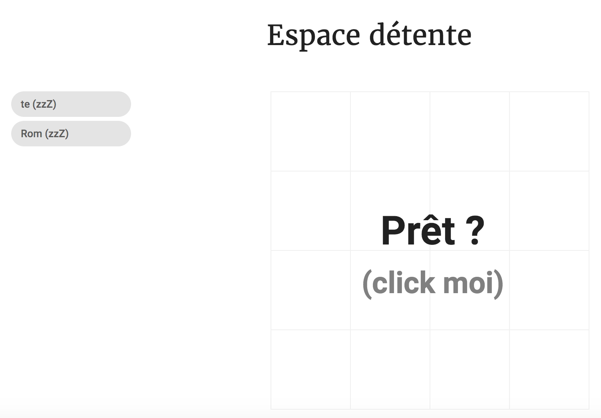
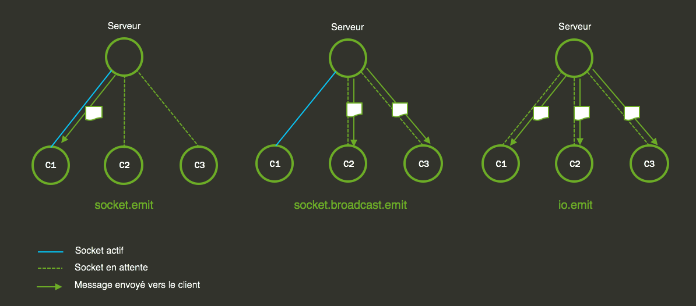

# Squaregame

L’objectif de ce TP est d’utiliser Socket.io pour créer un mini jeu Client / Serveur en temps réel.

## Principe du jeu

Le mini jeu oppose deux joueurs dans un duel de réflexe. Le jeu présente une grille sur laquelle apparaîtra de façon 
aléatoire un carré coloré cliquable. Le premier joueur cliquant sur le carré obtient un point. 
La partie est terminée lorsque l’un des joueurs atteint le score de 5 points.



## Directives

Pour ce TP la partie cliente est déjà développée.
Vous aurez donc à charge de développer la partie back-end, c’est-à-dire le serveur Socket. Ce serveur viendra se 
greffer sur le serveur Express. Vous devrez gérer un certain nombre d’actions comme suivant :

* Gérer les connexions/déconnexions clients,
* Gérer la file d’attente des joueurs,
* Lancer la partie quand tous les joueurs sont prêts,
* Envoyer à intervalle régulier la nouvelle position d’un carré,
* Compter le score et synchroniser les informations entres les joueurs,
* Indiquer le gagnant lorsque le score est atteint.

## Rappel

Voici un rappel du principe des communications entre le client et le server avec Socket.io :




## Installation

```bash
npm install --save socket.io
npm install --save-dev @types/socket.io
```

## Configuration du serveur

```typescript
@ServerSettings({
    rootDir: Path.resolve(__dirname),
    componentsScan: [
        "${rootDir}/services/**/*.js" // à rajouter
    ]
})
class Server extends ServerLoader {
 ...
}
```
> L'option componentsScan permet d'injecter automatiqument des services au serveur Web.

## SocketService

Ts.Ed permet de créer des plugins via des Services. Nous allons donc créer un service dédié à la gestion des Sockets.

```typescript
import * as SocketIO from "socket.io";
import {Service, OnServerReady, Inject, ExpressApplication, HttpServer} from "ts-express-decorators";

@Service()
export class SocketService implements OnServerReady {
      private io: SocketIO.Server;
      private stacks = [];

      constructor(
          @Inject(HttpServer) private httpServer: HttpServer
       ) {

      }

      $onServerReady() {
          this.createServer();
      }

      /**
       * Store all callbacks that will be adding to socket.io instance when
       *  it'll be created. See SocketService.createServer().
       */
      public onConnection(callback: Function): SocketService {
          this.stacks.push(callback);
          return this;
      }

      public emit = (...args) => this.io.emit(...args);

      createServer()  {
           this.io = SocketIO(this.httpServer.get());

           // Map all callbacks to this connection events.
           this.stacks.forEach(cb => this.io.on('connection', cb));
      }
}
```

> Grâce à se service nous pourrons nous abonner au événement socket.


### Notre controller

Nous devons créer une nouvelle classe pour gérer le server Socket.io. 

Voici son squelette :

```typescript
import {Controller} from "ts-express-decorators";
import {$log} from "ts-log-debug";

@Controller("/")
export default class SquareGameWS {
    /**
     *
     */
    static MAX_PLAYERS: number = 2;
    /***
     *
     * @type {number}
     */
    static SCORE_MAX: number = 10;
    /**
     *
     * @type {Map<string, SocketIO.Socket>}
     */
    static players: Map<string, PlayerSG> = new Map<string, PlayerSG>();
    /**
     *
     */
    static tick;

    private player;

    constructor (
        private socketService: SocketService
    ) {
        socketService.onConnection(this.onConnection);
    }
    
    @Get("/")
    @Render("home")
    async renderHome() {
        return {MAX_PLAYERS, SCORE_MAX}
    }
    
    onConnection = (socket) => {
        $log.debug('New connection, ID =>', socket.id);
        
        //premier événement, ajout d'un utilisateur
        socket.on('client.player.add', this.onAddPlayer);

        //player say i'am ready
        socket.on('client.player.ready', this.onPlayerIsReady);

        //start interval
        socket.on('client.start.game', this.onStartGame);

        //delete square
        socket.on('client.delete.square', this.onDeleteSquare);

        //player disconnect
        socket.on('disconnect', this.onDisconnect);
    }

    /**
     * Ajoute une joueur à la liste des joueurs.
     * Emet l'événement 'newplayer' si le joueur vient d'être créé.
     * @param name
     */
    public onAddPlayer = (name: string): void => {};

    /**
     *
     * @param io
     */
    public onStartGame = (): void => {};

    /**
     *
     */
    public onPlayerIsReady = (): void => {};

    /**
     *
     */
    public onDeleteSquare = (): void => {};

    /**
     *
     */
    public onDisconnect = (): void => {};

    /**
     *
     */
    public updatePlayersReady(): void {}
    /**
     *
     */
    public sendSquarePosition = (): void => {};

    /**
     *
     * @returns {number}
     */
    static getNbPlayersReady(): number {
        
        return 0;
    }

    /**
     * Retourne la liste des joueurs.
     * @returns {Array}
     */
    static getPlayers(): PlayerSG[] {
    
        return null;
    }

    static stopGame(): void {}
}
```

Nous allons développer les méthodes nécessaires aux fonctionnement de notre jeu dans les étapes suivantes.


## Informations utiles

Nous allons réaliser les actions de notre jeu. Vous devrez développer les événements et méthodes qui suivent :

#### Evénements entrants

**client.player.add**

Cet événement gère l’ajout d’un joueur à la file d’attente. 
Si la file d’attente est pleine, le joueur ne sera pas ajouté. 
Dans le cas contraire la méthode ajoute l’utilisateur à la file 
d’attente et un événement [`server.player.new`](#serverplayernew) est envoyé à tous les 
clients connectés.

**client.player.ready**

Le client indique au serveur que le joueur enregistré est prêt à jouer. 
La méthode doit stocker l’état du joueur est renvoyer la liste des joueurs 
aux clients via l’évènement [`server.update.players.ready`](#serverupdateplayerready).

Si tous joueurs sont prêts alors la méthode doit émettre un événement
 [`server.start.countdown`](#serverstartcountdown).

**client.start.game**

Une fois que le `countdown` est terminé, les clients vont émettre un événement `client.start.game`. Cet événement côté
 serveur lancera un « Timer » qui émettra à un intervalle régulier l’événement [`server.update.square`](#serverupdatesquare).

**client.delete.square**

Cet événement est envoyé par un client lorsque le joueur clique sur le carré. 
La méthode va donc incrémenter le score du joueur ayant cliqué le carré. 
Un premier événement [`server.deleted.square`](#serverdeletedsquare) sera envoyé à l’ensemble des clients 
pour indiquer que le carré est à supprimer.

Si le score de 5 points est atteint par l’un des joueurs, les actions suivantes sont effectuées :

* Interruption du « Timer ».
* L’événement « playerloose » est diffusé.
* L’événement « playerwin » est émis vers le client associé au socket.

**disconnect**

Cet événement est généré lorsqu’un client se déconnecte du serveur. 
L’objectif est de supprimer le joueur de la file d’attente est d’interrompre et de stopper le 
« Timer » si il est actif. Un événement `server.stop.game` sera diffusé vers les clients connectés pour stopper le jeu.

#### Evénements sortants
**server.player.new**

Indique à l’ensemble des clients qu’un nouveau joueur est enregistré.

* **Type** : broadcast
* **Paramètre** : La liste des joueurs.

**server.update.player.ready**

Indique à l’ensemble des clients qu’un joueur est prêt à jouer.

* **Type** : broadcast
* **Paramètre** : Liste des joueurs.

**server.start.countdown**

Indique aux clients que tous les joueurs sont prêts et que le compte à rebours doit démarrer.

* **Type** : broadcast
* **Paramètre** : aucun

**server.update.square**

Indique aux clients la nouvelle position du carré à cliquer.

* **Type** : broadcast
* **Paramètre** : un object square

**server.deleted.square**

Indique à l’ensemble des joueurs que le carré a été cliqué par l’un des joueurs.

* **Type** : broadcast
* **Paramètres** : 
  *	La liste des joueurs,
  * Le joueur ayant cliqué le carré.

**server.player.loose**

Indique à l’ensemble des clients, sauf celui associé au socket, qu’ils ont perdu.

* **Type** : socket.broadcast.emit
* **Paramètre** : Le joueur ayant gagné.


**server.player.win**

Indique au client associé au socket qu’il a gagné.

* **Type** : socket.emit
* **Paramètre** : Le joueur ayant gagné

**server.stop.game**

Indique aux clients que le jeu est stoppé suite à la déconnexion d’un joueur.

* **Type** : broadcast
* **Paramètres** :
  *	L’utilisateur déconnecté,
  * La liste des joueurs.
  
### Classe de donnée PlayerSG

Voici un exemple de la structure d’un joueur :

```typescript
export default class PlayerSG {

    /**
     *
     */
    name: string;
    /**
     *
     */
    isReady: boolean;
    /**
     *
     */
    private score: number = 0;

    constructor(private userId: string) {

    }

    /**
     *
     */
    public scoreUp(): void {
        this.score++;
    }

    /**
     *
     * @returns {number}
     */
    public getScore(): number {
        return this.score;
    }

    /**
     *
     */
    public toJSON = (): any => ({
        userId: this.userId,
        name: this.name,
        score: this.score,
        isReady: this.isReady
    });
}
```


#### Modèle Square

Voici un exemple du modèle de données d’un carré :

```json
{
   "index": 1, 
   "bgc": "#FFFFFF"
}
```

**Règles :**

* La valeur de l’index est comprise entre 0 et 12. 
* La valeur de `bgc` est un code couleur hexadécimal.

Ces deux valeurs sont à définir de façon aléatoire. Pour définir un code couleur
hexadécimal aléatoire voici un exemple de code :

```typescript
"#" + ((1<<24) * Math.random() | 0).toString(16)
```
